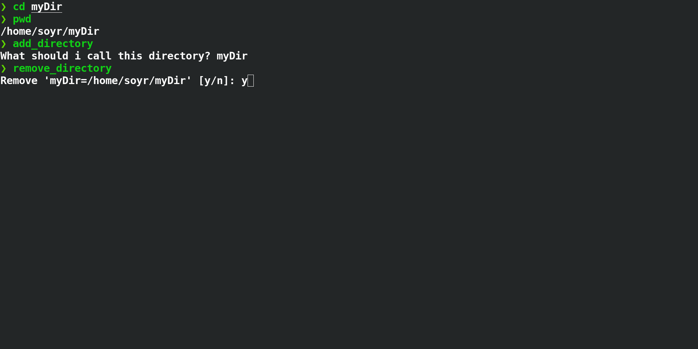

# Westchange zsh plugin

It's a simple plugin that allows you to quickly change between directories.
The way it works it's that you store/save a directory to a file, later you can change to these directories by sorting through that list using the fzf utility. Simple yet effective (for it to be this way I highly recommend that you setup the hotkey to switch).

## Index

1. [Screenshots](#screenshots)
2. [Usage](#usage)
3. [Dependencies](#dependencies)
4. [Installation](#installation)
5. [Settings](#settings)


## Screenshots




## Usage

Just navigate to a directory that you want to quickly switch to. Once in that directory run `add_directory` or whatever alias you've set for it. And that's it, now you can quickly switch to it by hitting your hotkey or using the command `switch_directory`. If you regret adding a directory you can remove it by using the command `remove_directory`

### Shortcuts
This plugin it's meant to work with shortcuts, I highly recommend you to set it up. At least use aliases!

## Dependencies
- [fzf (fuzzy finder)](https://github.com/junegunn/fzf)

## Installation

### Manual

Just source the entry point `$>source westchange.sh`

### Oh-my-zsh

It integrates with the plugin installer

#### Post installation

Close your terminal emulator and open again to enjoy!

## Settings

You can set the path of the file that stores the saved paths/directories by setting _WC_DIRECTORIES_.
By default:
```bash
WC_DIRECTORIES=${0:A:h}/directories
```
